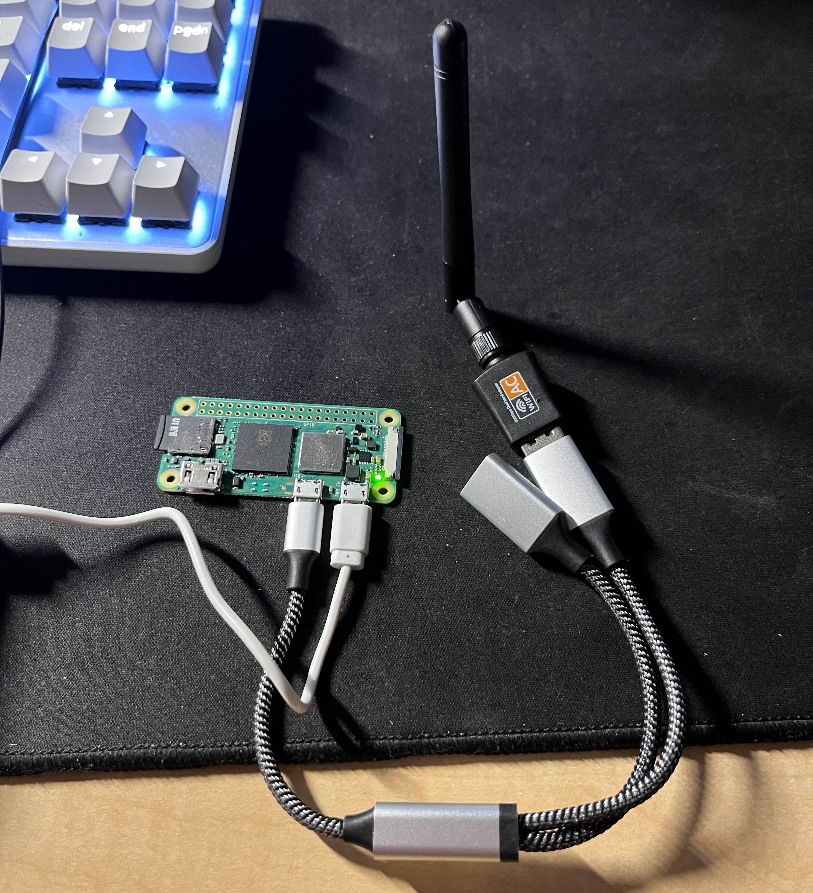
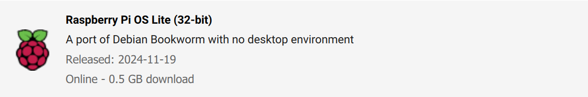

# Full setup for a WiFi router on your Raspberry Pi

# Required material
- Raspberry Pi (Any model, better model = better performance)
- Total of TWO WiFi modules
  1. Typically a wifi chip is built into the raspberry pi (Hosts hotspot)
  2. A USB antenna or adapter (Connects to WiFi and pushes connection to hotspot)
- For Raspberry Pi Zero 2W: (1:1) MALE micro USB to FEMALE USB-A converter
- For setup: WiFi network that displays allows connection between devices on that network (most home, apartment, and private networks), your local coffee shop WiFi may not work for setting this device up
  - If you're trying to use your apartment WiFi and you need a specific MAC address from the raspberry pi before it can connect to the WiFi, send me a message and I can help you out :) You'll need a temporary separate WiFi connection or hotspot to use
- Any wire that connects to a male micro USB for power


# Instructions

## Raspberry Pi Setup
1. Flash raspberry pi with headless OS onto a micro SD card

  - Custom settings:
    - Set hostname: <somehotspotname>.local
    - Enable SSH (Use password authentication)
    - Set username and password (write this down!)
    - Configure wireless LAN to your home network
    - Ensure wireless LAN county and locale settings are correct
  > For this example I'll use the following settings
  > myhotspot.local
  > Username: user
  > Password: pass
  > Connected to WiFi: mywifi

2. Open micro SD card and create an EMPTY file named `ssh`

  - You can do this by going to your file explorer:
    1. Create a new `.txt` file and rename it to `ssh`
    2. Make sure the file extension `.txt` is deleted

3. Insert micro SD card into your raspberry pi and plug micro USB into power
  - For Raspberry Pi Zero 2W: should see flashing green light (give it ~90 - 120 seconds or until it stops flashing sporadically) 
  - Once your raspberry pi stops blinking sporadically, it's setup and ready to go

4. Plug in your WiFi antenna/adapter via the USB A or micro USB port


## Connecting to Raspberry Pi
1. Make sure your computer is connected to the same network your raspberry pi was configured to connect to
2. Open your command line interface (CLI) 
  - Windows + R
  - Type in `cmd`
  - OK
3. Login to your raspberry pi using SSH
```bash
ssh user@myhotspot.local
```
4. *If you reflashed your micro SD card and are trying this again make sure to run the below command to clear specific key files
```bash
ssh-keygen -R <somehotspotname>.local
```
5. Type `yes` if prompted 
6. Type in your password (characters will be invisible) and you will see something similar to the image below

7. Run commands
```bash
sudo apt update
```
8. Connect `wlan1` to WiFi
```bash
sudo nmcli device wifi connect "<YourWiFiName>" ifname wlan1
```
9. Delete the preconfigured WiFi, then reboot (if not kicked out) and connect via `wlan1` (instead of `wlan0`)
```bash
sudo nmcli connection delete "preconfigured"
```
```bash
sudo reboot
```
10. Check method of connection, should be `wlan1` stated at the end of the line
```bash
who
```
11. Host hotspot on `wlan0`
```bash
sudo nmcli connection add type wifi ifname wlan0 con-name "Hotspot" autoconnect yes autoconnect-priority 100 ssid "<yourhotspotname>"
```
```bash
sudo nmcli connection modify "Hotspot" \
  802-11-wireless.mode ap \
  802-11-wireless.band bg \
  ipv4.addresses 10.42.1.1/24 \
  ipv4.method shared \
  802-11-wireless-security.key-mgmt wpa-psk \
  802-11-wireless-security.psk "<yourpassword>" \
  802-11-wireless.channel 1
```


## Setup WiFI Portal
1. Install python
```bash
sudo apt install python3-flask
```
2. Clone my repo
```bash
git clone https://github.com/MarcusHsieh/rpi-wifi-router.git
```


## Setup `app.py` to run on boot
1. Use `systemctl` or `crontab -e` to launch on boot (We'll use `systemctl` in this tutorial)
2. Create new systemd service file 
```bash
sudo nano /etc/systemd/system/wifi-portal.service
```
3. Add this configuration to file (Replace `/path/to/` with the actual path to your `app.py` AND <username> with your username)
> My `/path/to` is `/home/<username>/rpi-wifi-portal`
```bash
[Unit]
Description=WiFi Portal Flask App
After=network.target

[Service]
ExecStart=/usr/bin/sudo /usr/bin/python3 /path/to/app.py
WorkingDirectory=/path/to/
Restart=on-failure
RestartSec=5
User=<username>
Environment=PYTHONUNBUFFERED=1

[Install]
WantedBy=multi-user.target
```
4. Reload systemd daemon to recognize new service
```bash
sudo systemctl daemon-reload
```
5. Enable service to start on boot, then start the service
```bash
sudo systemctl enable wifi-portal.service
sudo systemctl start wifi-portal.service
```
6. Reboot
```bash
sudo reboot
```


### Debug commands
```bash
nmcli device
```
```bash
nmcli connection
```
```bash
sudo systemctl status wifi-portal.service
```

# Conclusion
My main goal for this project was to have a wifi router that allowed me to make SSHing much easier while traveling and for networks with strict device access. In my case, my apartment WiFi and school WiFi requires additional steps to connect to simply connect to their network. This allows me to preconfigure all of my Raspberry Pi's to this one WiFi router and not have to constantly manually reconnect to my apartment WiFi, then my school WiFi, then back to my apartment WiFi, and on and on. In addition, my school WiFi has restrictive access (settings adjusted for network isolation, IP address visibility, port blocking, etc.) to see other devices connected to it (important for SSHing). This restrictive access is of course good for general purposes, which is why I built a separate WiFi router for myself to solve this issue.

Send me a message if you need any debugging assistance!
