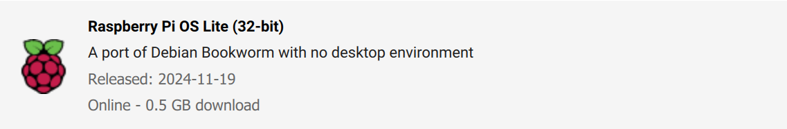

# rpi-wifi-router
Raspberry Pi Wi-Fi Router

# Required material
- Raspberry Pi (Any model, better model = better performance)
- Total of TWO WiFi modules
  1. Typically one is built into the raspberry pi (Hosts hotspot)
  2. A USB antenna or adapter (Pushes WiFi connection)
- For Raspberry Pi Zero 2W: (1:1) MALE micro USB to FEMALE USB-A converter
- For setup: WiFi network that displays allows connection between devices on that network (most home, apartment, and private networks), your local coffee shop WiFi may not work for setting this device up
  - If you're trying to use your apartment WiFi and you need a specific MAC address from the raspberry pi before it can connect to the WiFi, send me a message and I can help you out :) You'll need a temporary separate WiFi connection or hotspot to use
- Any wire that connects to a male micro USB for power

# Instructions

## Raspberry Pi Setup

0. Flash raspberry pi with headless OS onto a micro SD card

  - Custom settings:
    - Set hostname: <somehotspotname>.local
    - Enable SSH (Use password authentication)
    - Set username and password (write this down!)
    - Configure wireless LAN to your home network
    - Ensure wireless LAN county and locale settings are correct
  > For this example I'll use the following settings
  > myhotspot.local
  > Username: user
  > Password: pass
  > Connected to WiFi: mywifi

0. Open micro SD card and create an EMPTY file named `ssh`

  - You can do this by going to your file explorer:
    1. Create a new `.txt` file and rename it to `ssh`
    2. Make sure the file extension `.txt` is deleted

0. Insert micro SD card into your raspberry pi and plug micro USB into power
  - For Raspberry Pi Zero 2W: should see flashing green light (give it ~90 - 120 seconds or until it stops flashing sporadically) 
  - Once your raspberry pi stops blinking sporadically, it's setup and ready to go

0. Plug in your WiFi antenna/adapter via the USB A or micro USB port

## Connecting to Raspberry Pi

0. Make sure your computer is connected to the same network your raspberry pi was configured to connect to
0. Open your command line interface (CLI) 
  - Windows + R
  - Type in `cmd`
  - OK
0. Login to your raspberry pi using SSH
```bash
ssh user@myhotspot.local
```
0. *If you reflashed your micro SD card and are trying this again make sure to run the below command to clear specific key files
```bash
ssh-keygen -R <somehotspotname>.local
```
0. Type `yes` if prompted 
0. Type in your password (characters will be invisible)
0. Run commands
```bash
sudo apt update
```
0. Connect `wlan1` to WiFi
```bash
sudo nmcli device wifi connect "<YourWiFiName>" ifname wlan1
```
0. Delete the preconfigured WiFi, then reboot (if not kicked out) and connect via `wlan1` (instead of `wlan0`)
```bash
sudo nmcli connection delete "preconfigured"
```
```bash
sudo reboot
```
0. Check method of connection, should be `wlan1`
```bash
who
```
0. Host hotspot on `wlan0`
```bash
sudo nmcli connection add type wifi ifname wlan0 con-name "Hotspot" autoconnect yes autoconnect-priority 100 ssid "<yourhotspotname>"
```
```bash
sudo nmcli connection modify "Hotspot" \
  802-11-wireless.mode ap \
  802-11-wireless.band bg \
  ipv4.addresses 10.42.0.1/24 \
  ipv4.method shared \
  802-11-wireless-security.key-mgmt wpa-psk \
  802-11-wireless-security.psk "<yourpassword>"
```
```bash
sudo nmcli connection modify "Hotspot" 802-11-wireless.channel 1
```
0. Use `systemctl` or `crontab -e` to launch on boot


0. Debug
```bash
nmcli device
```
```bash
nmcli connection
```

